# ripple

A countdown timer app for Pebble smartwatches with multiple visual display modes.

## Display Modes

| Mode | Description | aplite | basalt | chalk | diorite | emery |
|------|-------------|--------|--------|-------|---------|-------|
| Text | Large numeric display showing time as h:mm:ss or m:ss |  |  |  |  |  |
| Blocks | 12x8 grid of blocks that empty as time passes |  | 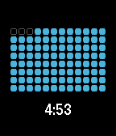 | 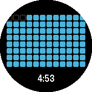 |  | 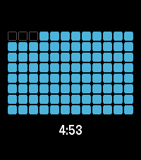 |
| Vertical Blocks | 8x12 grid filling bottom to top, left to right |  | 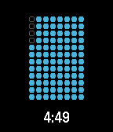 | 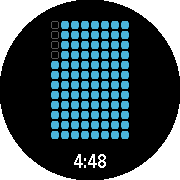 | 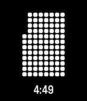 | 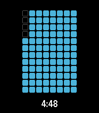 |
| Clock | Analog clock face with filled arc and sweeping hand |  | 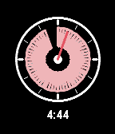 | 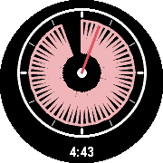 | 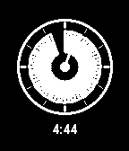 |  |
| Ring | Thick circular arc that depletes clockwise |  |  | 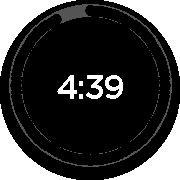 |  | 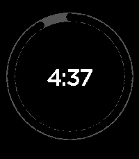 |
| Hourglass | Sand timer with particles moving between chambers | 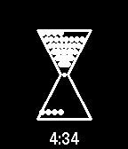 | 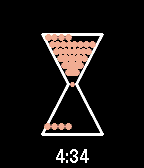 |  | 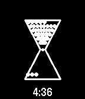 | 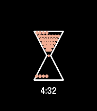 |
| Binary | Three rows of 6-bit binary dots (h/m/s) |  | 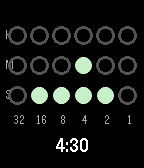 | 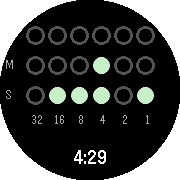 | 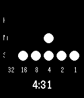 | 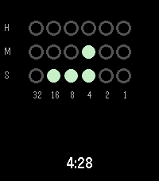 |
| Radial | Concentric rings for hours, minutes, seconds |  | 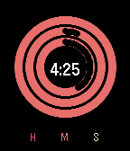 | 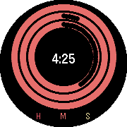 | 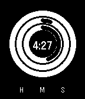 | 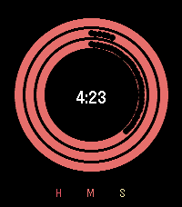 |
| Hex | Time in hexadecimal with decimal equivalent | 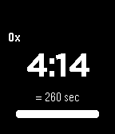 |  | 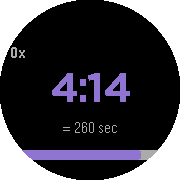 | 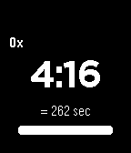 | 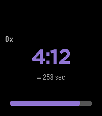 |
| Matrix | Falling green digits with time in center | 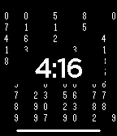 | 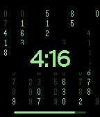 | 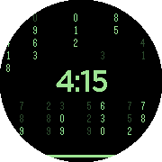 |  | 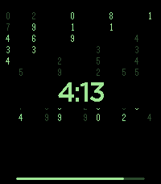 |
| Water Level | Container with draining water level |  | 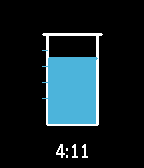 | 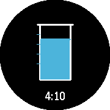 | 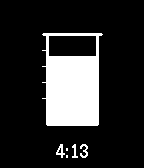 | 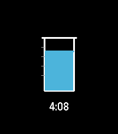 |
| Spiral Out | Spiral pattern expanding outward | 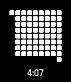 |  | 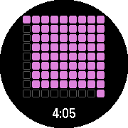 | 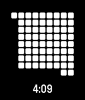 | 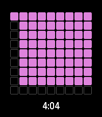 |
| Spiral In | Spiral pattern contracting inward |  | 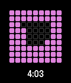 | 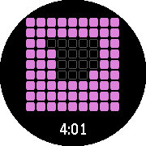 | 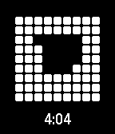 | 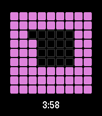 |
| % Elapsed | Large percentage of time elapsed | 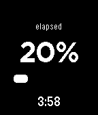 | 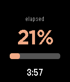 | 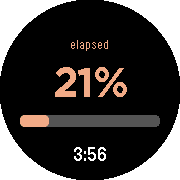 |  |  |
| % Remaining | Large percentage of time remaining | 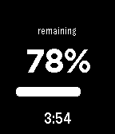 | 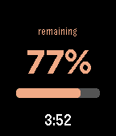 | 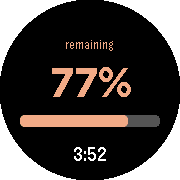 |  |  |

## Controls

### Preset Selection Screen

| Button | Action |
|--------|--------|
| UP | Previous preset option |
| DOWN | Next preset option |
| SELECT | Start timer with selected preset |
| SELECT (hold) | Cycle through display modes |
| BACK | Exit app |

### Custom Time Entry

| Button | Action |
|--------|--------|
| UP | Increase value |
| DOWN | Decrease value |
| SELECT | Confirm and proceed |
| BACK | Return to preset selection |

### Timer Running

| Button | Action |
|--------|--------|
| DOWN | Pause timer |
| SELECT (hold) | Cycle through display modes |
| UP (hold) | Toggle time text visibility |
| BACK | Pause and show exit confirmation |

### Timer Paused

| Button | Action |
|--------|--------|
| DOWN | Resume timer |
| SELECT (hold) | Cycle through display modes |
| UP | Restart timer from beginning |
| BACK | Show exit confirmation |

